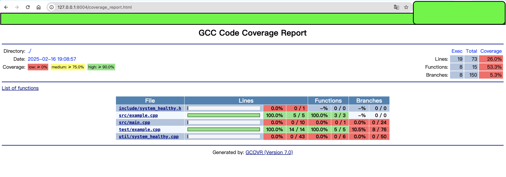
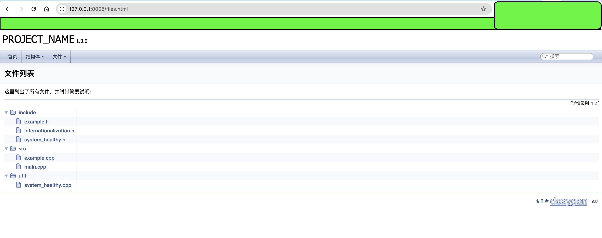
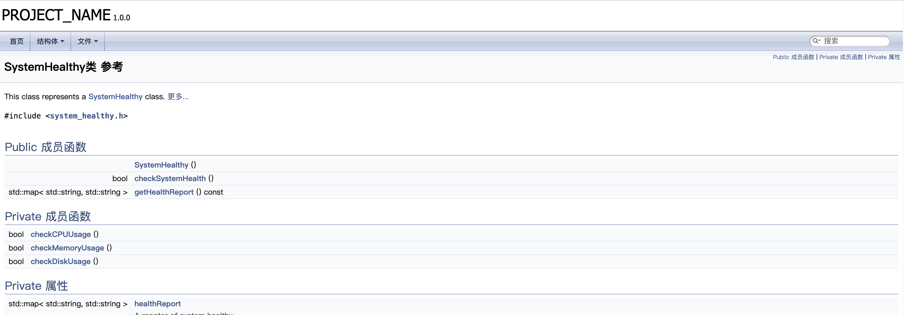

# fast_cpp_server

A template of cpp server.


### Add tools for cpp porject

* code coverage
* code doc genarte tools
* tcp relink client

## docker dev

### gen container

```bash
docker run -it --name my_container_name -p 8004:4444 -p 8005:5555 -v /code:/workspace fast_cpp_dev:latest /bin/bash
```

## show code coverage in docker server



### show code document






## How can I compile binary executable file ?

```shell
cd ${PROJECT_ROOT}
mkdir build
cd ./build
cmake ..
make -j
```

## How can I Exec unit test ?

```shell
cd ${PROJECT_ROOT}
mkdir build
cd ./build
cmake ..
make -j
# ------------
cd ./bin
ls -l | grep "fast"
# -rwxr-xr-x 1 root root  2496096 Jun 11 18:47 fast_cpp_server
# -rwxr-xr-x 1 root root  2299192 Jun 11 18:48 fast_cpp_server_Test
cd -

ctest 

```

## How can I generate Code coverage report ?

```shell
cd ${PROJECT_ROOT}
cd build
# compile binary executable file
#  Exec unit test
make coverage

cd ./../scripts/
sh /workspace/scripts/start_server_for_covorage_report.sh
```

## How can I generate Code Design document ?

```shell
cd ${PROJECT_ROOT}
doxygen Doxyfile
cd ${PROJECT_ROOT}/scripts
sh start_server_for_code_dwsign_docment.sh

```
## Unit Test

测试可执行程序（如 fast_cpp_server_my_Test）添加参数的方式，运行特定的测试用例或测试套件

✅ 方式一：运行特定测试（用 --gtest_filter=）

示例：只运行某一个具体的测试用例
```shell
./bin/fast_cpp_server_my_Test --gtest_filter=ExampleTest.Add
```
示例：运行某个测试套件下的所有用例

```shell
./bin/fast_cpp_server_my_Test --gtest_filter=ExampleTest.*
```

示例：运行多个测试（用通配符）

```shell
./bin/fast_cpp_server_my_Test --gtest_filter="MyConfigTest.*:MyLogTest.*"
```

✅ 方式二：排除某些测试（加负号）

```shell
./bin/fast_cpp_server_my_Test --gtest_filter=-MyConfigTest.*
```

✅ 常用调试参数补充（可搭配使用）

* --gtest_filter=	只运行指定测试
* --gtest_repeat=N	重复运行 N 次
* --gtest_break_on_failure	第一个失败时立即中断（调试用）
* --gtest_output=xml:report.xml	导出测试结果为 XML


## FQA

* if MQTT con't start, run:
```shell
export LD_LIBRARY_PATH=/workspace/build/external/mosquitto/lib:$LD_LIBRARY_PATH
```