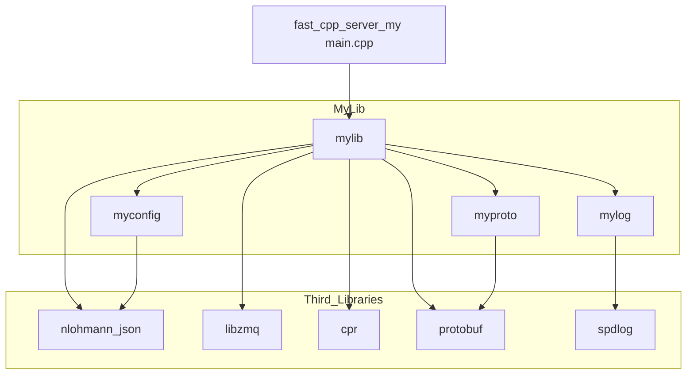
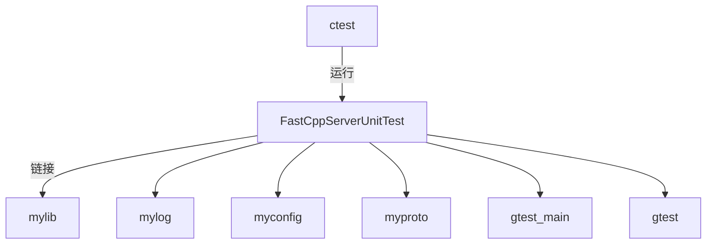

# fast_cpp_server

项目 `fast_cpp_server` 是一个结构清晰、模块化良好的 **现代 C++ 服务端项目**，使用 `CMake` 管理，支持：

* **模块化静态库构建**（`mylog`, `myconfig`, `myproto`, `mylib` 等）
* **单元测试集成**（`GTest`）
* **代码覆盖率支持**（`gcovr`）
* **打包支持**（`CPack`）
* **颜色打印增强可读性**

---

## 🧩 项目结构说明

### 📁 目录结构概览

```
/workspace
├── CMakeLists.txt            # 根构建脚本
├── external/                 # 第三方依赖（protobuf, spdlog, etc.）
├── scripts/                  # 安装/启动脚本
├── config/                   # 配置文件
├── service/                  # service 文件
├── src/                      # 项目源码
│   ├── main.cpp              # 入口函数
│   ├── CMakeLists.txt        # 构建 mylib 静态库
│   ├── proto/                # proto 源文件
│   ├── protobuf/             # proto 生成的 .pb 文件
│   ├── tools/                # 功能模块
│   │   ├── example/          # 示例模块
│   │   ├── http/             # HTTP 功能
│   │   ├── mqtt/             # MQTT 功能
│   │   ├── ping_tools/       # CPR Ping 工具
│   │   ├── simple_tcp_client/ # TCP 客户端
│   │   ├── system_healthy/   # 系统健康信息（内存、CPU 等）
│   │   └── thread_safe_buffer/ # 线程安全 Buffer
│   └── util/                 # 工具类
│       ├── my_config/        # 配置读取逻辑
│       └── my_log/           # 日志模块
└── test/                     # GTest 单元测试代码
```

---

## 🔧 编译模块依赖关系

项目主程序：`fast_cpp_server_my` 依赖多个静态库，如下：

A --> C[mylog]
A --> D[myconfig]
A --> E[myproto]



---

## 🛠 构建系统亮点

* **每个模块都有独立的 CMakeLists.txt**（如 `mylog`、`myproto`）
* 使用 `option()` 控制模块构建（如 `BUILD_MY_LOG`）
* 使用 `print_colored_message()` 和 `pretty_print_list()` 增强构建日志的可读性
* 自动编译 `.proto` 文件为 `.pb.h` / `.pb.cc` 并生成库 `myproto`
* 使用 `GLOB_RECURSE` 动态获取源文件，便于新增文件自动生效
* `CTest` 自动注册单元测试（`ENABLE_TEST=ON`）

---

## 🧪 测试集成说明



* 统一执行测试：`ctest`
* 启用条件控制：`option(ENABLE_TEST "Enable unit testing" ON)`
* 断言库：Google Test

---

## 🧩 构建流程简述

1. 第三方库 `add_subdirectory` 加入构建
2. 编译 `mylog`, `myconfig`, `myproto`, `mylib` 等静态库
3. 使用这些静态库构建主程序 `fast_cpp_server_my`
4. 构建测试程序 `fast_cpp_server_my_Test`
5. 启用 `CTest` 测试
6. 使用 `gcovr` 支持生成代码覆盖率报告
7. 最后打包可执行文件、脚本、配置文件等（通过 `CPack`）

---

## 🧳 打包结构（CPack）

安装包将包含以下内容：

```
/bin/
  └── fast_cpp_server_my
  └── fast_cpp_server_my_Test
/lib/
  └── 所有静态库
/config/
  └── 配置文件
/service/
  └── service描述文件
./start.sh
./install.sh
./uninstall.sh
```

---
